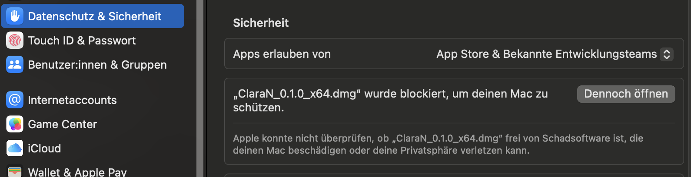
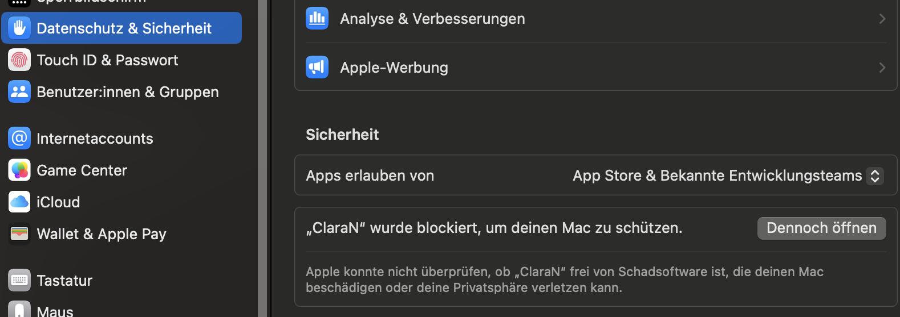
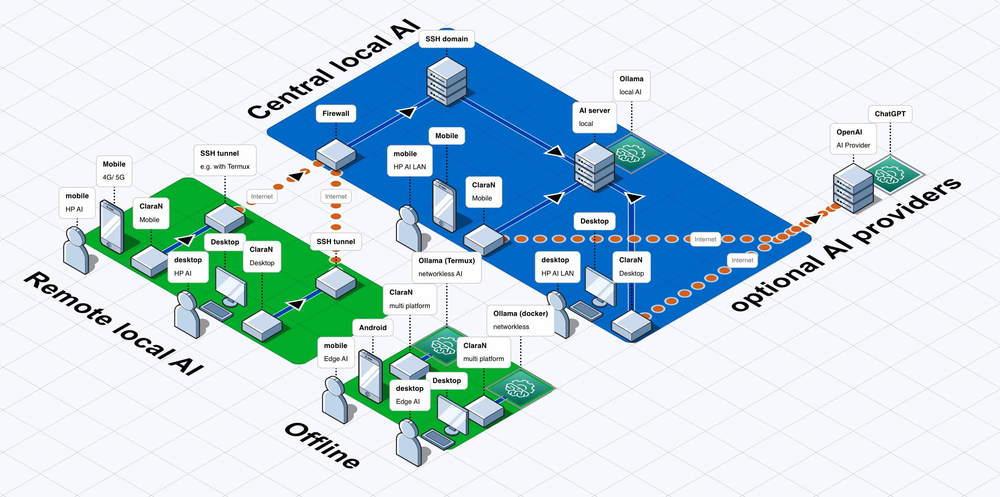
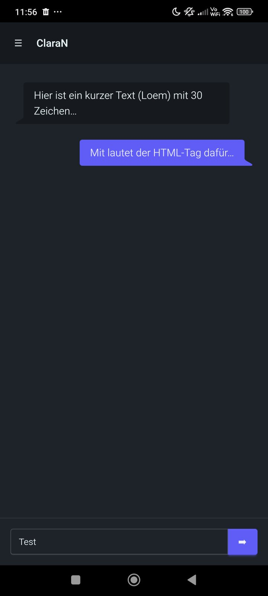
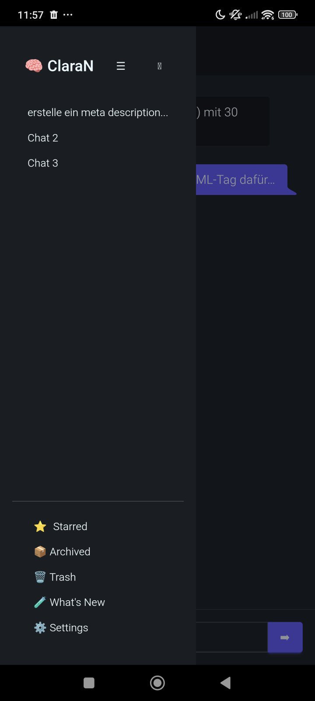
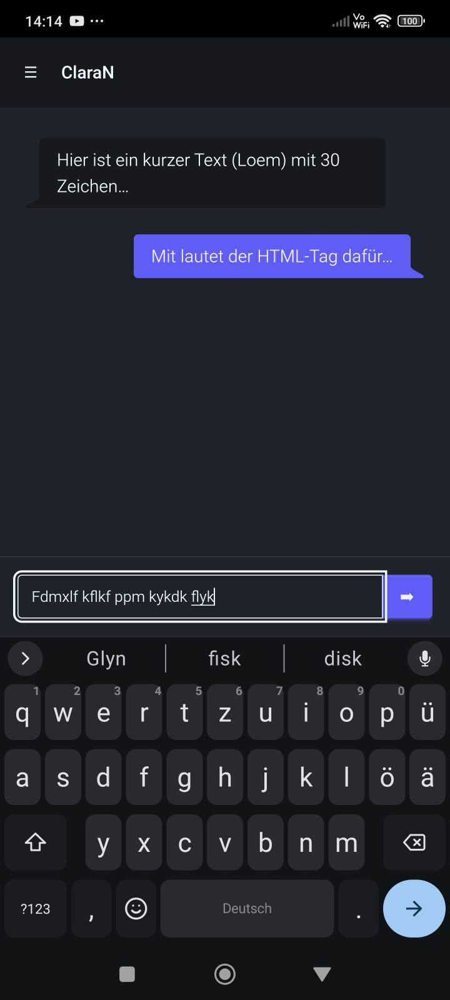
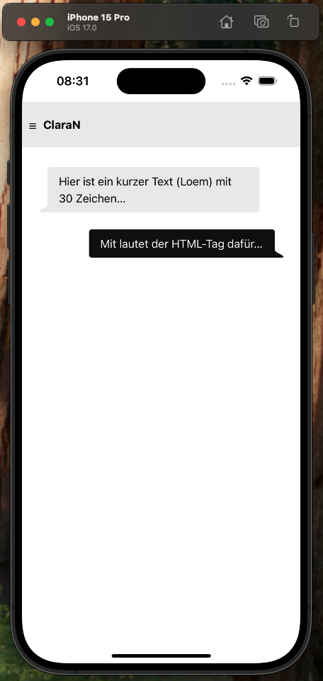
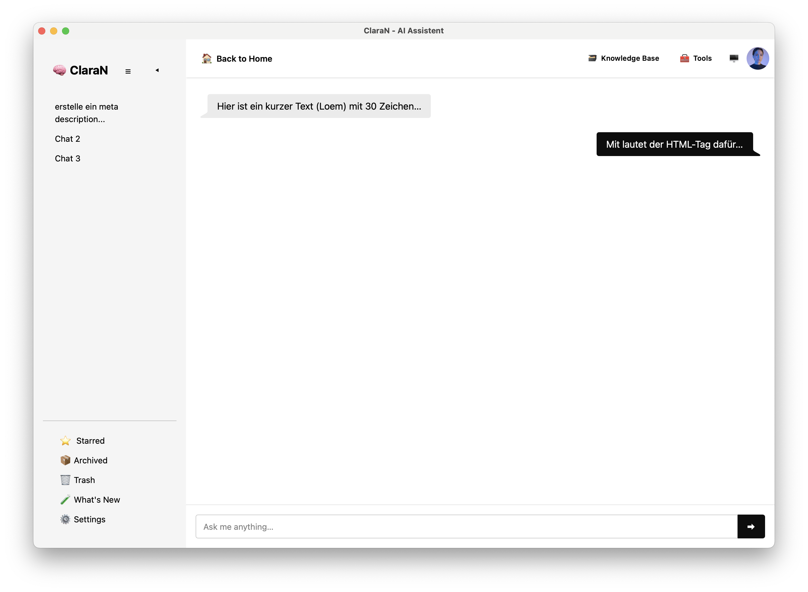
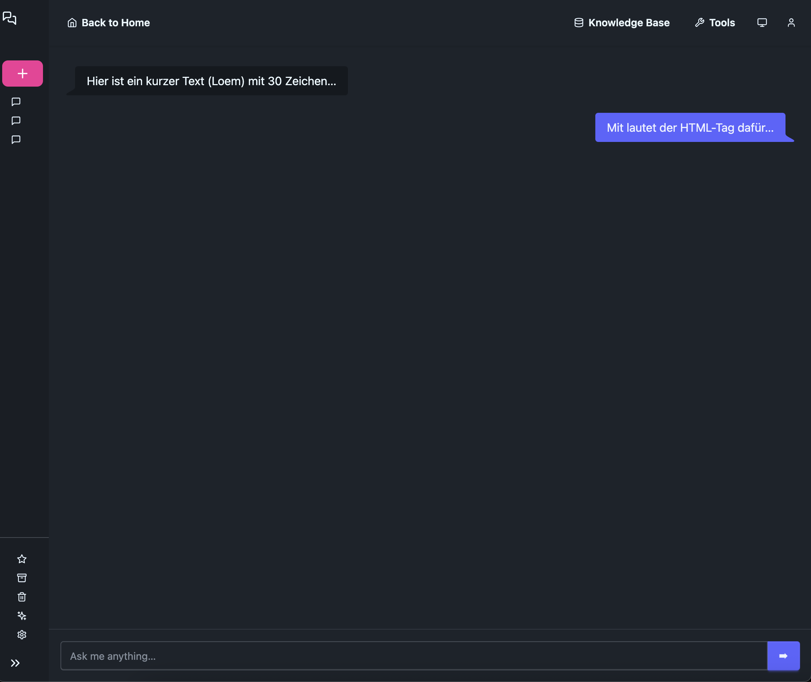

# ClaraN

**Your fully local AI Superstack - Privacy-First, On-Premises, Limitless**

ClaraN isn't just another chat UI. It's a complete AI ecosystem that runs 100% on your machines.

This is a hardfork of the awesome project https://github.com/badboysm890/ClaraVerse

## Tech Stack

- [Tauri](https://tauri.app/) for building Desktop- and Mobile apps as a hybrid and secure framework - using [Rust](https://www.rust-lang.org/) and web technologies
- [Qwik](https://qwik.dev/) web framework for building performant Web UIs
- [Nodejs](http://nodejs.org/) Javascript for tooling
- [DaisyUI](http://daisyui.com/) for faster, cleaner and simple [tailwind CSS](https://tailwindcss.com/) UI development


## Supported environments

### 🖥️ Desktop App

| operation system | supported | bundle |
|---|---|---|
| [MacOS](https://github.com/vanvuongngo/ClaraN/releases/latest) | :white_check_mark: | aarch64.dmg (aarch64.app.tar.gz), x64.dmg (x64.app.tar.gz) |
| Apple Store | N/A | please [buy me a coffee](https://buymeacoffee.com/vuongngo) for an apple developer license $99 |
| [Windows](https://github.com/vanvuongngo/ClaraN/releases/latest) | :white_check_mark: | x64-setup.exe, x64_en-US.msi |
| [Linux](https://github.com/vanvuongngo/ClaraN/releases/latest) | :white_check_mark: | amd64.AppImage, amd64.deb, x86_64.rpm |

<details>
<summary>🔥 Click to see Troubleshooting</summary>

#### Troubleshooting

- *Failed to run AppImage on Ubuntu:* AppImages require FUSE to run
```sh
sudo apt-get install libfuse2
```

- *Failed to run AppImage on Debian:* The installation is failing because of missing libraries. Any clue how to fix?

- *Failed to build android on MacOS* `pnpm build:android`: set the OPENSSL_DIR env

1a.  find the path with `brew`
```sh
brew info openssl@3
```

1b. or find the path with `whereis`
```sh
whereis openssl
```

2. set path in your environment, e.g. `~/.zshrc`
```
export OPENSSL_DIR=/usr/local/Cellar/openssl@3/3.5.1
```

- *Installation blocked on MacOS*

Open settings then **Security & Privacy** -> scroll to **Security** and **force open**


When start the app go also to the settings then **Security & Privacy** -> scroll to **Security** and **force open**


</details>

### 📱 Mobile App

| operation system | supported | bundle |
|---|---|---|
| [Android](https://github.com/vanvuongngo/ClaraN/releases/latest) | :white_check_mark: | apk, aab |
| iOS | :white_check_mark: | is planned |

## Scenarios diagram



## 🛠️ Development Setup

```sh
# Install once the global dependency
npm install -g pnpm

# Install dependencies
pnpm install
````

### Web app
```sh
pnpm dev:web
```

### Desktop app
```sh
pnpm dev
```

### Android mobile app
- prerequisites: openjdk, Android Studio with one installed emulator
```sh
pnpm dev:android
```

### iOS mobile app
- prerequisites: XCode
```sh
pnpm dev:ios
```

## Internationalization

ClaraN supports internationalization for multiple languages: english, deutsch

usage:
```js
{$localize`What is New`}
```

When you are done with your code changes, you can use the `i18n-extract` command to extract the translations from the code. This will update the [message.en.json](apps/clara-n/src/locales/message.en.json) file.

```sh
pnpm i18n-extract
```

## 📸 **Visual Showcase**

<details>
<summary><strong>🖼️ Click to see screenshots</strong></summary>

### 📱 **Mobile Chat**

<table>

<thead>
<tr>
  <th>System</td>
  <th>Chat</th>
  <th>Sidebar</th>
  <th>Keyboard</th>
</tr>
</thead>

<tbody>

<!-- Android -->
<tr>
<td style="vertical-align: baseline;">Android</td>
<td></td>
<td></td>
<td></td>
</tr>

<!-- iOS -->
<tr>
<td>iOS</td>
<td></td>
<td></td>
</tr>

</tbody>
</table>


### 🖥️ **Desktop Chat**

<table>

<thead>
<tr>
  <th>System</td>
  <th>Chat</th>
  <th>Collapsed sidebar</th>
</tr>
</thead>

<tbody>

<!-- MacOS -->
<tr>
<td style="vertical-align: baseline;">MacOS</td>
<td></td>
<td></td>
</tr>

</tbody>
</table>

</details>

## 🆚 ClaraN vs The Competition

| Feature | **ClaraN** | **ClaraVerse** | OpenWebUI | LibreChat | Ollama WebUI |
|---------|------------|----------------|-----------|-----------|--------------|
| 💻 **100% Local Stack** | ✅ Complete | ✅ Complete | ✅ Yes | ✅ Yes | ✅ Basic |
| 🧩 **Visual App Builder** | ❌ No | ✅ Built-in | ❌ No | ❌ No | ❌ No |
| 🔄 **Native Automation** | ❌ No | ✅ N8N Integrated | ❌ No | ❌ No | ❌ No |
| 🧠 **Agent Builder** | ❌ No | ✅ Visual Designer | ❌ No | ❌ No | ❌ No |
| 🎨 **Image Generation** | ❌ No | ✅ ComfyUI | ✅ Basic DALL-E | ❌ No | ❌ No |
| 🧱 **Widget System** | ❌ No | ✅ Dynamic Dashboard | ❌ No | ✅ Basic | ❌ No |
| 🔧 **Code Execution** | ❌ No | ✅ OpenInterpreter | ❌ No | ❌ No | ❌ No |
| 📱 **Mobile App** | ✅ Tauri - Android [iOS] | ❌ in progress | ❌ Web Only | ❌ Web Only | ❌ Web Only |
| 🖥️ **Desktop App** | ✅ Tauri - MacOS Linux Windows | ✅ Electron | ❌ Web Only | ❌ Web Only | ❌ Web Only |

## Features

- Simple deployment for all mobile and desktop apps
- Get new features easily with the App updater on desktop
- Internationalization depends on the OS locale (EN/ DE)
- Small bundle size and installation
- Better developer experience with Qwik and DaisyUI (self-opinionated)
- Secure by using uptodated system native webview

## 🗓️ Release Timeline & Roadmap


### 🎯 Current Release Status

| **Component** | **Status** | **Description** |
|---------------|------------|-----------------|
| 🧠 **Clara AI Assistant** | 0.4.0 open | Chat Interface with multi-provider support |
| 🐳 **Docker Deployment** | 0.3.0 in progress | One-command local deployment |
| 🧠 **Clara AI Assistant** | ✅ **0.2.0 Released** | Chat Interface with ollama provider support |
| 🧠 **Clara AI Assistant** | ✅ **0.1.1 Released** | Started with UI layout |
| 📱 **Mobile Apps** | ✅ **Released** | Android support, iOS (simulator only) |
| 🖥️ **Desktop Apps** | ✅ **Released** | Windows, macOS, Linux support |

## 🔐 Privacy & Security

| 🛡️ **Privacy Feature** | **Status** | **Details** |
|------------------------|------------|-------------|
| **Local Processing** | ✅ 100% | All AI models run on your machines |
| **No Telemetry** | ✅ Zero | No data collection or phone home |
| **Open Source** | ✅ Full | Complete codebase transparency |
| **Self-Hosted** | ✅ Complete | Own your entire AI stack |
| **No Cloud APIs** | ✅ Optional | Cloud providers only if you choose |
| **Encrypted Storage** | ✅ Built-in | Local data encrypted by default |


## 🌍 Community & Support

Any help is welcome ...
<div align="center">

### Join the ClaraN Community


<table>
<tr>
  <td align="center">
    
    <br/><strong>GitHub</strong><br/>
    <a href="https://github.com/vanvuongngo/ClaraN/issues">Issue</a> -
    <a href="https://github.com/vanvuongngo/ClaraN/pulls">PR</a> -
    <a href="https://github.com/users/vanvuongngo/projects/4">Board</a>
  </td>
</tr>
</table>

</div>


## How to run on mobile Android
  
1. Install termux
   
2a. **networkless mode**:

install ollama local AI server
```
pkg install ollama
```

run ollama
```
ollama serve
```

then pull AI model (other models will come)
```
ollama pull llama3.2
```

2b. **shared ollama server**:

- setup ssh port forward

## How to build a new release

1. Clone the project
```sh
git clone git@github.com:<USER>/ClaraN.git
```

2. Create a tag and push it, e.g. `v1.0.0`, which will trigger the github CI
```sh
git tag v1.0.0 && git push origin v1.0.0
```

3. A new draft release will created and you can add more informations about the changes, here https://github.com/USER/ClaraN/releases

4. Ensure that the github secrets are setup for the mobile builds: https://github.com/USER/ClaraN/settings/secrets/actions

5. Ready? Click: `publish release`

## 📜 License
ClaraN is open-source software licensed under the MIT License. This means you can:

- ✅ Use it commercially
- ✅ Modify and distribute
- ✅ Use it privately
- ✅ Contribute back to the community
